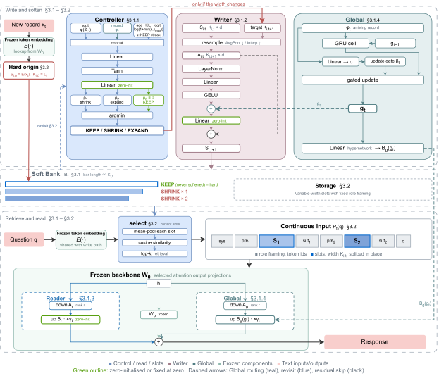

# HasMem: Hard-Origin Adaptively Softened Memory for Long-Term LLM Agents

HasMem maintains persistent memory as continuous slots initialized from a frozen language model's token embeddings. A learned Controller selects KEEP, SHRINK, or EXPAND; the Writer re-encodes retained slot values, and Reader and Global residuals adapt how the frozen backbone uses memory.

This repository contains the training and evaluation implementation, local configuration files, deterministic data preparation, and tests. The implementation supports Qwen2.5-Instruct backbones and the Mistral-Instruct adapter configuration described in the paper.

[](assets/architecture.svg)

[High-resolution PNG](assets/architecture.png)

## Installation

Use Python 3.10 or newer. Create and activate a virtual environment:

```bash
python -m venv .venv
# Linux/macOS: source .venv/bin/activate
# Windows PowerShell: .venv\Scripts\Activate.ps1
```

Install a CUDA-enabled PyTorch build suitable for your GPU inside this active environment, then run:

```bash
python -m pip install -e .
python -m unittest discover -s tests -v
```

LLM training and inference require a CUDA GPU supporting bfloat16 and enough memory for the frozen backbone, its activations, and memory slots. The CPU tests do not download models or data. An additional CUDA integration test creates a tiny random model and checks training, checkpoint restoration, and generation.

Model IDs can be downloaded through Transformers; a local model directory can also be used. Set optional `model_revision` to a Hugging Face commit hash to pin both model and tokenizer; omitting it preserves the default revision behavior. Use the same revision when restoring a checkpoint. Set `local_files_only` to `true` for offline execution. If a model requires authentication, export `HF_TOKEN` in your shell. `.env.example` lists optional environment variables with empty values; the program does not automatically load `.env` files. Keep tokens and populated local configuration files outside version control.

## Data

### MSC-derived reconstruction probe

Prepare the paper cohort from the pinned [MSC dataset mirror](https://huggingface.co/datasets/nayohan/multi_session_chat). Install the optional data dependency, then download and prepare its train and validation splits:

```bash
python -m pip install -e ".[data]"
python -m hasmem.preparation.msc --download-source /path/to/msc-source --output-dir data/msc
```

The downloader pins the dataset revision and verifies each downloaded file by SHA-256. Preparation then verifies every selected record and the complete ordered model input against the released text-free cohort manifests. The reconstructed train and development inputs match the paper traces. The Qwen2.5-7B evaluation cohort contains 268 development owners, 646 records, and 535 questions. `manifest.json` points to the prepared traces; `DATA_AUDIT.json` records tokenizer-dependent counts and final cohort hashes.

For an existing compatible JSONL export, use `--source-dir /path/to/msc/jsonl` instead of `--download-source`. Source provenance, dataset terms, input schema, and transformation details are described in [Data preparation](docs/DATA.md).

### LongMemEval-S

Download `longmemeval_s_cleaned.json` from the [LongMemEval repository](https://github.com/xiaowu0162/LongMemEval) and set `data.longmemeval` in your local configuration. The default evaluates all 500 questions. LongMemEval-S is loaded after training and checkpoint selection. Leave this field empty to evaluate only MSC-derived data.

Raw datasets and pretrained or trained model weights are not bundled in this repository.

## Train

Copy a configuration and edit its model/data paths before running. Relative data paths are resolved from the configuration file's directory. `check-config` verifies the configured manifest and required data files without loading a model. Training, evaluation, and inference also check their required input files before model loading.

```bash
python -m hasmem check-config --config configs/fixed_steps.json
python -m hasmem train --config configs/fixed_steps.json --output outputs/fixed_steps
```

The available recipes preserve different experimental protocols:

| Configuration | Curriculum progress | Checkpoint used for evaluation |
| --- | --- | --- |
| `configs/paper_main_wallclock.json` | Elapsed policy-training time | Last completed update |
| `configs/fixed_steps.json` | Policy update count, 5,081 target policy updates | Last completed update |
| `configs/multiseed_selection.json` | Policy update count, 5,081 target policy updates | Lowest training loss while the non-KEEP EMA is in the selection band; final iterate if no checkpoint qualifies |

All recipes use 384 warmup updates, seed 2026091331, and retrieval width 8 by default. The fixed-step recipes target 5,465 total updates. `runtime.training_seconds` is a timeout, so inspect `TRAINING.json` to confirm the completed count. The main wall-clock run in the paper completed 5,465 updates; update counts on other hardware can differ. [Reproduction protocols](docs/REPRODUCIBILITY.md) explains how the main result and cross-seed checkpoint experiment differ.

Training writes adapter/Memory weights to `checkpoint.pt`; frozen backbone weights remain separate. It also records configuration, dataset hashes, training updates, selection metadata, exact hard-initialization checks, and evaluation rows. Output directories must be new to avoid mixing experiments.

## Evaluate a checkpoint

Checkpoints enforce matching model identity, tokenizer, engine, seed, retrieval width, maintenance count, and method flags. Keep the training configuration when evaluating or inferring. Local Qwen2.5/Mistral model sizes are resolved from architecture; other local architectures require an explicit `backbone_tag`. A historical checkpoint without compatibility metadata requires `allow_legacy_checkpoint: true` after verifying its source configuration.

```bash
python -m hasmem evaluate --config configs/fixed_steps.json --checkpoint outputs/fixed_steps/checkpoint.pt --output outputs/evaluation
```

The default compares HasMem with hard prompts using the same retrieval function and retrieval width. `rows.jsonl` contains per-question predictions and scores; `SUMMARY.json` contains user-weighted aggregates, paired statistics, and separately labeled question-weighted metrics. F1 and EM are stored as fractions; multiply by 100 for paper percentages. Answer NLL excludes the terminal token during evaluation. Cover and Brief are local rule-based metrics, not official model-judge accuracy. The paper's local Qwen-judge results use the separate judging pass below.

A time-limited incomplete evaluation is marked `partial_timeout` and exits with an error. Verify the dataset and condition counts before interpreting a result as a full benchmark.

## Local Qwen judging

```bash
python -m hasmem.judge --rows outputs/evaluation/rows.jsonl --refs /path/to/longmemeval_s_cleaned.json --model Qwen/Qwen2.5-7B-Instruct --output outputs/local_judge
```

This uses the LongMemEval task-specific yes/no prompts with local Qwen2.5-7B-Instruct, greedy decoding, and at most 10 generated tokens. It requires all 500 question IDs in every evaluated condition; `--allow-subset` explicitly enables a diagnostic subset with matching IDs. Outputs preserve the raw judge response, parsed label, per-type accuracy, input hashes, and judge configuration. Accuracy is stored as a fraction. This reproduces the local Qwen judging procedure; the reference LongMemEval evaluator uses a different judge configuration. Prompt text is attributed under the [LongMemEval MIT license](third_party/LongMemEval-LICENSE).

## Run on local records

```bash
python -m hasmem infer --config configs/fixed_steps.json --checkpoint outputs/fixed_steps/checkpoint.pt --records examples/records.json --question "Where is the meeting room?" --output outputs/example
```

`--records` is a JSON array of record strings ordered by arrival. Inference constructs the memory, applies its maintenance steps, retrieves records for the question, and generates an answer. A trained checkpoint is required for learned softening. The example records are constructed demonstrations, not evaluation data.

## Repository layout

- `hasmem/core.py`: frozen backbone, slot Writer, Reader/Global adapters, generation, and evaluation.
- `hasmem/engines/`: wall-clock and fixed-step training protocols and Controller rollout.
- `hasmem/search.py`: constrained short-horizon action search.
- `hasmem/data.py` and `hasmem/preparation/`: dataset construction and loading.
- `hasmem/metrics.py` and `hasmem/stats.py`: local metrics and grouped paired statistics.
- `configs/`: portable paper-related recipes.
- `tests/`: causal rollout, no-op identity, search, data, and integration checks.

## License

The HasMem code is released under the [MIT License](LICENSE), permitting academic and commercial use, modification, and redistribution with the copyright and license notices preserved. Third-party components retain their respective licenses. Datasets and pretrained models are governed by their original terms.

## Citation and contact

See [CITATION.cff](CITATION.cff) for author and title metadata. The arXiv identifier will be added after the preprint is available.

Authors: Zihong He, Junxiao Shen, Chen Liang, and Hai-Ning Liang.

Contact: [Zihong He](mailto:zhe154@connect.hkust-gz.edu.cn); corresponding authors: [Chen Liang](mailto:chenliang2@hkust-gz.edu.cn) and [Hai-Ning Liang](mailto:hainingliang@hkust-gz.edu.cn).
